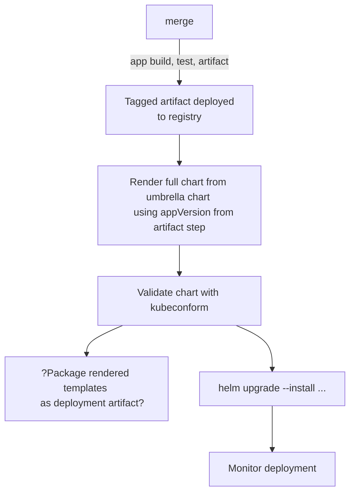

# Continuous Deployment

## Introduction

* deployment separate from delivery (feature flags)
* Helm renders Kubernetes manifests for deployment
  
> Two use-cases today: app deployment and cluster middleware deployment. 

## Helm as App CD Tool

* Focused on microservice-based model.
* Helm deployment name will be based on microservice name.
* appVersion only variable of consequence from deployment to deployment.
* Deployment chart will be shared between environments.
* `values.yaml` will be stored in properties repo, one per environment.

TODO:

* explore best method for canary or blue/green deployments
  * integration with service mesh
  * some interactivity required to approve move from partial to full deployment, or rejection of deployment.
* explore triggering event based on new tag deployed to container registry
* explore upgrading chart version, but not upgrading app version
* explore secret management
  * how to originate secrets into key vault / secret manager
  * internal (not shared) vs external (shared) secrets

### Continuous Deployment Workflow

## Helm as Middleware Management Tool

* Use middleware provided helm charts
* Manage our own values.yaml 
* Each M/W component gets its own pipeline and properties repo

TODO: figure out how to converge both use-cases