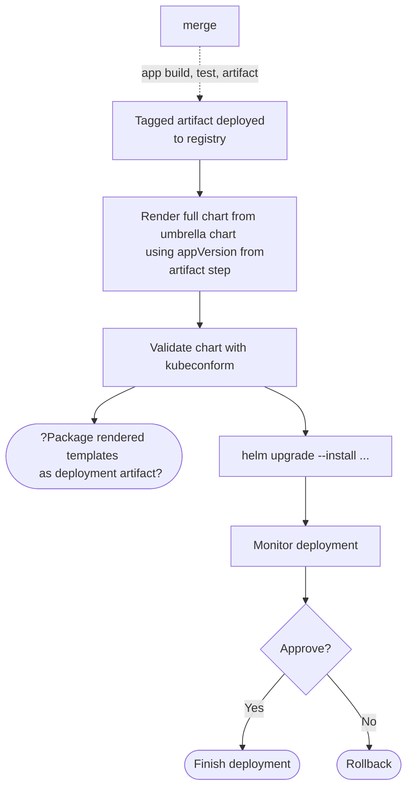

# Continuous Deployment

## Introduction

* deployment separate from delivery (feature flags)
* Helm renders Kubernetes manifests for deployment
  
> Two use-cases today: app deployment and cluster middleware deployment. 

## Helm as App CD Tool

* Focused on microservice-based model.
* Helm deployment name will be based on microservice name.
* appVersion only variable of consequence from deployment to deployment.
* Deployment chart will be shared between environments.
* `values.yaml` will be stored in properties repo, one per environment.
* `Chart.yaml` will live in app repo
  * define dependencies and versions
  * dependencies will include Launch-managed deployment chart for microservices
  * `appVersion` will be a **magic** value, replaced or inserted at deployment time with artifact version ID
  * `appVersion` propagates into manifests as deployed image tag (and potentially other targets)

### Open Questions

* explore best method for canary or blue/green deployments
  * integration with service mesh
  * some interactivity required to approve move from partial to full deployment, or rejection of deployment.
* explore triggering event based on new tag deployed to container registry
* explore upgrading chart version
  * implications to app availability, disruptions, etc
* explore upgrading chart version, but not upgrading app version
  * probably will make policy against this, but need to understand it
* explore secret management
  * how to originate secrets into key vault / secret manager
    * most likely via IaC, not via Helm
  * internal (not shared) vs external (shared) secrets
* explore how to know if data schema is appropriate for app version to be deployed
* explore how to deploy "data"
  * helm chart as "job"
  * includes helm metadata with deployed version?
  * integrated with app deployment chart, or separate?

### Continuous Deployment Workflow

## Helm as Middleware Management Tool

* Use middleware provided helm charts
* Manage our own values.yaml 
* Each M/W component gets its own pipeline and properties repo

TODO: figure out how to converge both use-cases